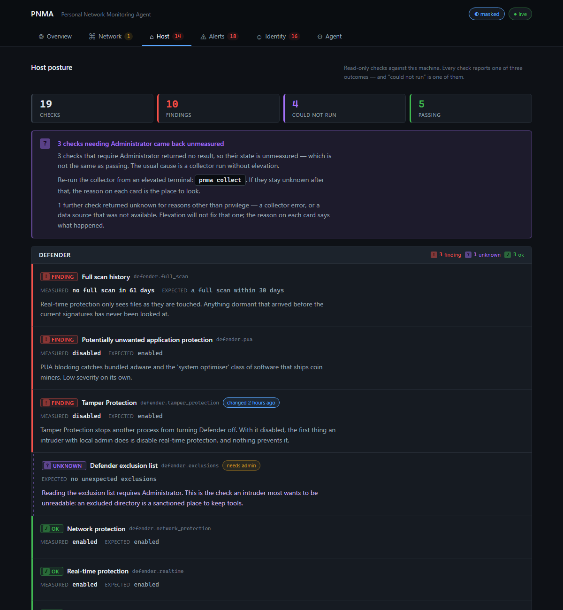

# PNMA — Personal Network Monitoring Agent

A home-network, host and identity posture monitor that is honest about what
it cannot see.

PNMA discovers the devices on the one network you have authorised it for,
inventories what they listen on, records whether they answer, audits the
security posture of the machine it runs on, and keeps a register of the
security controls on your own accounts. It renders all of that as a dashboard
you can open on a laptop or install on a phone — over a private WireGuard
tailnet, never the open LAN.

Its one rule, applied everywhere: **a control that was not measured is
`unknown`, and `unknown` never renders as passing.**


> Every screenshot in this repository comes from `pnma seed`, a synthetic
> network. No real MAC address, hostname or SSID appears anywhere in this
> project.

---

## What it does

| Domain | Collector | What you get |
|---|---|---|
| **Network** | passive ARP/DHCP capture (kernel BPF filter, nothing else reaches userspace), polite `nmap -sn` discovery, top-100 port scans at `-T2`, ICMP availability | device inventory keyed by MAC with vendor lookup from the vendored IEEE registry, open ports with a risk grade, reachability and round-trip time, a network map |
| **Host** | read-only Windows checks: Defender, PowerShell logging, process auditing, log clearing, unsigned drivers, SYSTEM tasks, SMB | 19 facts, each `ok` / `finding` / `unknown`, with `unknown` meaning *the check could not run* (usually: not elevated) |
| **Identity** | an attestation register for accounts *you own*, plus optional Have I Been Pwned lookups | per-account MFA, phishing-resistant factor, password hygiene, recovery paths, sessions, login alerts, breach exposure — attestations **rot back to `unknown`** after a review window |
| **Detections** | 11 rules, each shipped with its own stated blind spot | correlated alerts mapped to ATT&CK techniques, with an ATT&CK Navigator layer export |
| **The agent itself** | scope guard, noise budget, audit log | its authorisation, its own safety posture, every probe it sent and every one it refused |


## What it deliberately is not

- **Not an attack tool.** No exploitation, no credential handling, no lateral
  movement. See [DISCLAIMER.md](DISCLAIMER.md) — read it before running this
  on a network other people use.
- **Not an IDS.** It sees what devices *listen on*, not what they send.
  Passive capture is pinned to `arp or (udp and (port 67 or port 68))` at the
  kernel; browsing traffic never reaches the process.
- **Not a provider integration.** Identity posture is attested, not scraped
  through OAuth. That is a design choice, explained in
  [`pnma/identity.py`](pnma/identity.py).
- **Not cloud-anything.** No LLM, no telemetry, no CDN. The dashboard works on
  a host with no route to the internet.

## Design constraints that are load-bearing

**Consent-constrained by design.** Other people share a home network and did
not ask to be monitored. The passive collector's BPF filter is a technical
constraint, not a promise; the port scanner runs at `-T2`, top 100 ports, no
service detection by default, because aggressive timing crashes IoT devices
and printers.

**Scope guard re-authorises every target.** The config names exactly one
CIDR and pins the gateway MAC. Discovery output is untrusted, so every address
it returns is re-checked before it is touched. Move the laptop to a café and
the collector refuses to run.

**Three-valued everything.** This came out of a real incident: a
`Get-WinEvent` call returned *"No events were found"* when the true answer was
`UnauthorizedAccessException`. A check that could not run was
indistinguishable from one that passed. So every check in every domain
reports `ok`, `finding` or `unknown`, and the dashboard scores `unknown`
against you.

**Port scans account for themselves.** Each scan brackets itself with ICMP
samples before and after, so "was that printer already asleep, or did we knock
it over?" is answerable from the database.

**The agent audits itself.** Every probe is logged; the API refuses to bind
to `0.0.0.0`; off-loopback binds require a bearer token; the dashboard shows
the agent's own safety checks alongside everyone else's.

## Dashboard

Six views: Overview, Network, Host, Alerts, Identity, Agent. Vanilla
JavaScript and inline SVG, no build step, no dependencies, served from an
explicit allowlist of files.

- **Posture rings** per domain. The number is the percentage of controls that
  are measured *and* ok — closing an `unknown` is worth exactly as much as
  fixing a finding.
- **Privacy mode** (on by default) masks every identifier at the single point
  strings reach the DOM: MACs keep vendor prefix and last octet, IPs the last
  octet, e-mails one character. Enough to recognise your own printer, nothing
  worth a screenshot leaking.
- **Installable.** Web-app manifest and icons; on iOS, Safari → Share → Add
  to Home Screen gives a full-screen app with a bottom tab bar.




## Quick start

Requirements: Python 3.11+, [nmap](https://nmap.org/), and for passive capture
[Npcap](https://npcap.com/) (Windows) or libpcap.

```sh
pip install -e .
cp config/pnma.example.toml config/pnma.toml   # then edit: cidr, gateway_ip, gateway_mac
pnma init          # or fingerprint the current network into a config
pnma check         # preflight: authorisation, capabilities, what will be degraded
pnma collect       # the collector -- runs until Ctrl-C
pnma serve         # the dashboard on http://127.0.0.1:8787
```

Want to see it without touching a network?

```sh
pnma seed                                              # synthetic 12-device network
pnma serve --database data/pnma-demo.db --no-token
```

### From your phone, privately

The dashboard is a complete recon report of your network. It is never exposed
on the LAN. Instead:

1. Install [Tailscale](https://tailscale.com/) (open-source WireGuard client)
   on the laptop and the phone, same account.
2. `pnma secrets set dashboard_token` — stored in the OS credential store
   (DPAPI / Keychain / Secret Service), never on disk in plaintext.
3. `pnma serve --bind tailscale` — binds only to this host's tailnet address.
4. On the phone: `http://<tailnet-ip>:8787`, enter the token once, Add to
   Home Screen.

`serve` refuses `0.0.0.0` outright, and refuses any off-loopback bind without
a token. Both refusals are pinned by tests.

### Identity register

```sh
pnma identity add gmail-main --provider google --category email --label "Main mailbox"
pnma identity attest gmail-main mfa ok --value "passkey + TOTP"
pnma identity attest gmail-main password_unique finding --reason "reused on two sites"
pnma identity list
pnma identity pwned                       # k-anonymous password check; prompted, never stored
pnma secrets set hibp_api_key             # then:
pnma identity breaches gmail-main
```

Attestations can also be recorded from the phone: every control on the
Identity view has ok / finding / unknown buttons. Unattested or expired
controls surface as alerts.

### Everything else

```
pnma audit          what the agent did, and its safety posture
pnma detections     every rule and the blind spot it admits to
pnma oui-update     refresh the vendored IEEE MAC vendor table
pnma secrets        API keys and the dashboard token, in the OS credential store
```

API docs at `/api/docs` and Prometheus exposition at `/metrics` (both behind the token when one is set; Swagger UI is easiest on loopback with `--no-token`).

## Privileges

PNMA is designed to run **unelevated**. On Windows that requires Npcap
installed with *"Restrict driver access to Administrators only"* unchecked
(`AdminOnly = 0`); note that this lets any local user capture packets, which
is a posture trade-off the host module should arguably report on itself.
Without it, discovery falls back to the OS ARP cache — which on Windows ages
entries out in seconds and misses most of the house — and the collector says
so rather than reporting an empty network.

The passive-capture gate asks the *driver* whether it can open a handle, not
the process whether it is an administrator. The two answers differ on exactly
the configuration above.

## Tests

```sh
pip install pytest
python -m pytest -q
```

`tests/test_security_surface.py` pins the properties that would otherwise be
found by looking at a phone: the token gate, bind policy, the static
allowlist, attestation rot, HIBP semantics (no key → `unknown`, never `ok`),
the privacy mask (run under node when available), and the capture-driver
probe. `tests/test_seed_correlation.py` asserts that every rule in the
default set produces at least one alert from synthetic data — so no rule can
ship untested.

## Layout

```
pnma/
  collectors/     passive.py  discovery.py  portscan.py  ping.py  arp_table.py  host_windows.py
  detections/     rules.py  host_rules.py  identity_rules.py  base.py
  api/app.py      FastAPI: JSON API, static allowlist, token gate
  web/            index.html  app.js  viz.js  style.css  manifest + icons
  identity.py     the attestation register and HIBP lookups
  guard.py        scope guard      audit.py   noise budget + activity log
  mitre.py        offline ATT&CK technique table + Navigator export
  seed.py         synthetic network, host and identity data
  secrets.py      DPAPI / Keychain / Secret Service
config/           pnma.example.toml (pnma.toml is gitignored: it identifies your home)
docs/img/         screenshots, all from the seed
tests/
```

## Status

Personal project by a SANS GCDA graduate; built for one household and
published so the design decisions can be argued with. Windows host module
only, so far — the macOS/Linux collectors are the obvious next piece, and the
identity register would benefit from a second measured control beyond HIBP.
See DISCLAIMER.md for the rules of use.

## License

MIT — see [LICENSE](LICENSE).
