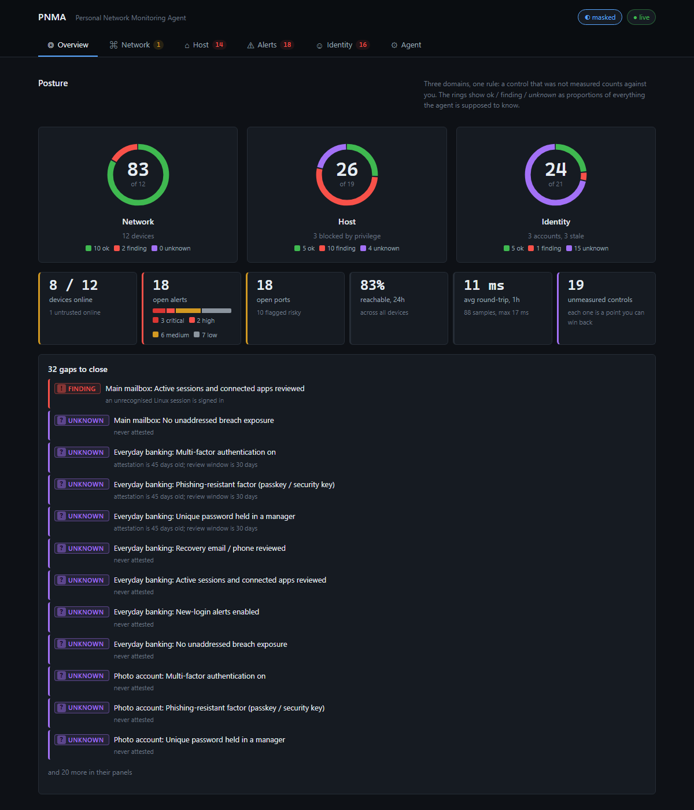
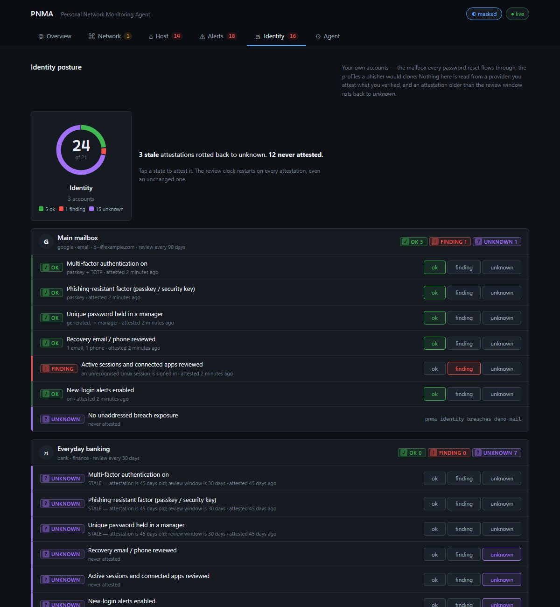
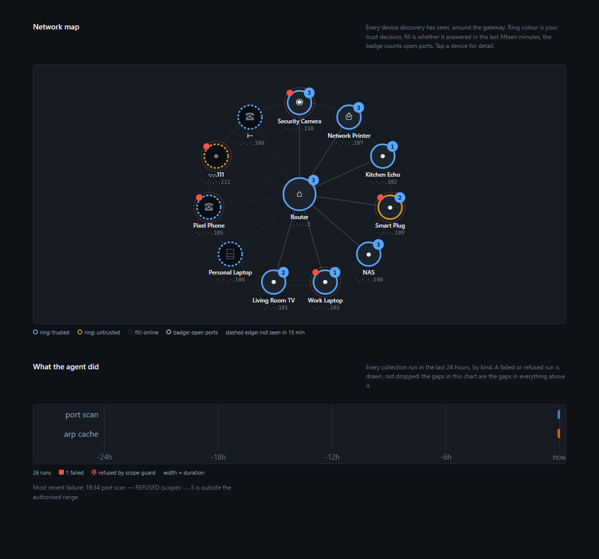

# I built a home network monitor that marks itself down for what it couldn't see

I'm a SANS GCDA grad, I share a flat, and I wanted to know what's on my Wi-Fi. That's how every home network monitoring project starts. Mine got weird fast because the first real question wasn't "what can I see", it was "what am I actually allowed to look at when other people live here too".

So I built PNMA — Personal Network Monitoring Agent. Open source, Python, runs on my laptop, dashboard installs on my phone over a private WireGuard tunnel. This post is what I built, what broke, and the one rule that ended up running the whole project.

## The rule: unknown is not ok

This came from a bug, not a design session.

I was auditing the laptop the agent runs on. Ran a normal PowerShell query for logon events:

```powershell
Get-WinEvent -FilterHashtable @{LogName='Security'; Id=4624}
```

Got back: **"No events were found that match the specified selection criteria."**

That was a lie. The real answer was `UnauthorizedAccessException`. I wasn't elevated and the Security log doesn't talk to you unless you are. The cmdlet ate the access error and returned an empty result, and an empty result looks exactly like "nothing happened". I actually wrote it into a report as clean before I caught it.

A check that could not run looked identical to a check that passed. That's the whole problem in one line.

So every check in PNMA has three states: `ok`, `finding`, or `unknown`. `unknown` means the check could not run. It gets stored, it gets alerted on, and it is never shown green. Then I pushed the same rule everywhere. A device that hasn't been seen in a day is `unknown`, not fine. An account control nobody has checked is `unknown`, not fine. The dashboard score for each domain counts `unknown` against you exactly the same as a `finding`. You don't get points for not looking.



Small thing. But it's also my honest answer to "why not just install Wazuh". Wazuh tells you what it collected. This tells you what it couldn't.

## Consent has to be in the code, not in a promise

Other people share my network and didn't ask to be monitored. "I'll only look at metadata" is a promise. A promise isn't a control. So the limits are technical and you can point at them:

- **Passive capture is pinned to a kernel BPF filter**: `arp or (udp and (port 67 or port 68))`. ARP and DHCP only — who's here and what they call themselves. Nobody's browsing traffic ever reaches the process because the kernel never hands it over.
- **Port scans are polite**: `nmap -T2`, top 100 ports, no service detection by default. Not for stealth. Because aggressive timing actually crashes IoT stuff and printers, and the flat would like its printer.
- **A scope guard re-checks every target.** The config names exactly one CIDR and pins the gateway MAC. Discovery output is untrusted (an ARP reply can say anything) so every address that comes back gets checked against scope again before it's touched. Take the laptop to a café and the collector just refuses to run.
- **The agent audits itself.** Every probe is logged against a noise budget, and there's a tab in the dashboard showing the agent's own safety checks next to the ones it runs on everyone else.

None of this makes monitoring a shared network "fine". It makes the limits inspectable. That's the most software can do. The DISCLAIMER.md in the repo is blunt about the rest.

## What the first live run actually found

For weeks the project only ran against synthetic data. `pnma seed` generates a fake network so no screenshot ever has a real MAC in it. Getting it to run live, unelevated, on Windows took longer than building it, and it came down to one registry value:

```
HKLM\SYSTEM\CurrentControlSet\Services\npcap\Parameters\AdminOnly = 1
```

That one value gates the entire network half of the tool. With it set, `nmap -sn` silently falls back to TCP-connect probing that returns no MAC addresses (and device identity in PNMA *is* the MAC), and scapy can't open the interface at all. Setting it to 0 isn't enough either — Npcap stamps the device permissions when the driver loads, so you need a reboot. I measured that instead of assuming it, and the measurement found a second bug: with the registry saying "open" and the loaded driver still saying "admins only", nmap switched to a SYN scan it couldn't run and quit — and my port scanner recorded that as **"0 open ports"**. A failed scan reading as a clean one. Same bug as the PowerShell one, different outfit. Fixed: a scan that didn't run now says it didn't run.

After the reboot, the real numbers:

- **Three open ports on the entire network, all on the gateway** (DNS, HTTP, HTTPS). Our attack surface is genuinely tiny.
- **Six live hosts** where the OS ARP cache showed three. Windows ages ARP entries out in seconds; without raw capture, half the house is invisible.
- **A printer that went quiet after being scanned.** Already asleep, or did we knock it over? Couldn't tell, because there was a 30-minute gap between the last liveness sample and the scan. So now every port scan pings before and after and records both. Next time the question has an answer.

And one more, found today while writing this. The passive collector's "can I capture?" check asked *am I admin?* instead of asking the driver. On a machine where Npcap lets non-admins capture, those answers are different, and the code was refusing something the driver would have allowed. An unelevated `sniff()` returned 22 ARP frames while the gate said no. It now probes the driver. This afternoon was the first time the collector has ever run in full mode, unelevated.

## Identity: attestations that expire

The domain I kept avoiding was identity. Network and host monitoring answer "what's on my network" and "is my laptop ok". Neither says anything about the things that actually get attacked — the mailbox every password reset goes through, the social accounts someone would clone.

The obvious build is OAuth integrations: read MFA state out of Google, Meta, GitHub. I didn't. Refresh tokens on disk, vendor APIs that change without warning, and a credential store that would become the most valuable thing on the machine. A monitoring tool whose secrets are worth more than what it monitors has the threat model backwards.

So the identity register is **attested**. You register accounts you own and record what you verified: MFA on, phishing-resistant factor enrolled, unique password in a manager, recovery paths reviewed, sessions reviewed, login alerts on. And then it *expires*. An attestation older than the account's review window drops back to `unknown` with the reason spelled out: "attestation is 45 days old; review window is 30 days". That's what "I checked this in March" honestly looks like.



One control is measured instead of attested: breach exposure via Have I Been Pwned. No API key → it records `unknown`, not `ok`, with the fix in the reason field. The password check uses the k-anonymity range API — five hex characters of a SHA-1 leave the machine and nothing else, and there's a test that asserts exactly that.

Gaps become alerts through the same detection engine as everything else, mapped to the ATT&CK technique the gap makes cheap (T1078 Valid Accounts, T1110.004 Credential Stuffing). The alert text says clearly: this is a gap you recorded, not an attack you observed.

## The phone problem

I wanted the dashboard on my phone. The dashboard is a finished recon report of my network. Those two things fight each other, and the lazy answer — bind to `0.0.0.0` — would put an unauthenticated control plane with state-changing endpoints on the exact network I'm meant to be careful about.

So:

- The server **refuses `0.0.0.0`**. Not a warning. It exits.
- Any bind off loopback **needs a bearer token**, kept in the OS credential store (DPAPI on Windows), compared in constant time.
- `pnma serve --bind tailscale` gets the laptop's tailnet address from the Tailscale CLI and binds only there. WireGuard authenticates the device; the token authenticates the person holding it. A phone left on a table is exactly where those two differ.
- Nothing listens on the LAN address. I checked with curl and there's a test for the policy.

The page itself has a **privacy mode**, on by default, applied at the one function every string goes through on its way to the DOM. MACs keep the vendor prefix and last octet, IPs keep the last octet, emails keep one character. Enough for me to recognise the printer, nothing worth a screenshot leaking. Add to Home Screen and it's a full-screen app with a bottom tab bar.



No chart library. All inline SVG, because the dashboard has to work on a box with no internet, and because every label on those charts is data read off a network the agent doesn't control — nothing is ever built as markup.

## I tested the security surface before I looked at the UI

Before I opened the dashboard once, I wrote tests for the stuff that would embarrass me on a phone: token gate returns 401 and leaks nothing in the body; a prefix of the token is not the token; `/../config/pnma.toml` is a 404; `0.0.0.0` exits; off-loopback without a token exits; attestations expire; no HIBP key means `unknown` never `ok`; the privacy mask, run under node, actually masks. And the seed test insists **every rule in the default set produces at least one alert from synthetic data** — which failed the moment I added the identity rules, because the seed had no identity data. Good. Now it does.

## What's still broken

I'd rather list these than have you find them:

- **`raise_alert` refreshes an existing alert's evidence but never its title, description or severity.** An alert from run 1 keeps stale reasoning attached to current evidence. Needs a decision (always refresh? only on escalation? keep versions?), not a one-liner, so it's still open.
- **Router logs aren't collected.** It's a retail TP-Link with no syslog export I can reach from the LAN, and automating its admin UI fails. What PNMA knows about the gateway, it learned by scanning it.
- **Windows only** for the host module. macOS collector is the obvious next piece, and a second vantage point, because a scanner can't honestly assess its own host.

## Try it

Repo: **[github.com/REPO_PLACEHOLDER](https://github.com/REPO_PLACEHOLDER)**. MIT, Python, no build step for the front end. `pnma seed` gives you a fake network to poke at without touching anything real. Read DISCLAIMER.md before you point it at a network other people use. It means it.

If you build something like this, take the one rule and leave the rest: **a check that could not run is not a check that passed.** Make it a state, store it, and make your dashboard charge you for it. Everything else in this project followed from that.
